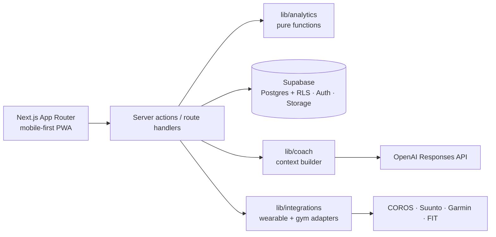

# LEBLOND

**Mobile-first climbing progression app with an integrated AI coach, Patrick “Le Blond”.**

> LEBLOND is an independent open-source climbing progression project and is not affiliated with Arkose, Climbing District, COROS, Suunto, Garmin or Strava.

## What is LEBLOND?

LEBLOND turns the “Road to 7A” idea into a real product: log every bouldering attempt in seconds, keep each gym's **native** grades, see deterministic progression analytics across gyms, attach photos/videos and wearable data, and talk it all through with Patrick.

### Product vision

A *personal climbing intelligence system*, not another logbook:

```
native gym data + cross-gym progression + wearable context + deterministic analytics + Patrick
```

### Why Patrick “Le Blond” exists

Numbers alone don't tell a climber what to do next. Patrick reads the statistics LEBLOND computes (never raw rows, never invented figures), separates observation from hypothesis, and suggests sustainable next steps. He is not a doctor and says so.

## Closed beta

Five people: Olivier (admin), Thomas, Marc, Houssem, David. There is no open sign-up — see [Supabase setup](#supabase-setup) for the whitelist. Real tester emails are never committed.

## Features (V1 “FIRST CLIMB + CONNECT”)

- Passwordless sign-in (6-digit code or magic link), five-person whitelist enforced in the app **and** in the database
- Two-minute onboarding (name, language, level, target, gyms, Patrick intro)
- Gyms: Arkose, Climbing District, independent/outdoor (Font or custom colours)
- Live session for chalky fingers: native-grade grid, one-tap **TRY · TOP · FLASH**, undo, flash suggestion, optional wall angle and style tags
- Session summary, problem pages, Font estimate kept separate from the native grade, private photos/videos, projects
- Progress: send/flash rate with counts, attempts per send, weekly activity, working level per native system, Font working grade (only when reliable), trend, road-to-target dimensions, cross-gym native and normalised views, style / wall-angle / gym breakdowns
- Patrick: streaming chat on the OpenAI Responses API with 8 quick actions and bounded structured context
- Wearables: FIT import for any watch, COROS/Suunto/Garmin OAuth adapters with truthful status, activity ↔ session linking, cross-source de-duplication
- PWA (installable), French and English

### Arkose grading

`YELLOW → GREEN → BLUE → RED → BLACK → PURPLE` (initiation → expert), stored as native grades. No fixed Font mapping — Arkose itself says colour systems vary. See [docs/grading.md](docs/grading.md).

### Climbing District grading

`WHITE → YELLOW → ORANGE → GREEN → BLUE → RED → BLACK → PURPLE`, plus **PINK = mystery** (deliberately hidden difficulty, never ranked). Colours overlap; no fixed Font mapping.

### Wearable connections

| Provider | V1 status | Method |
|---|---|---|
| FIT file | Works for every watch | Official Garmin FIT SDK, any vendor's export |
| COROS | Requires provider approval until partner access | Partner API (OAuth 2.0) + FIT fallback |
| Suunto | Requires provider approval until Cloud API access | Cloud API (OAuth 2.0 + subscription key) + FIT fallback |
| Garmin | Requires provider approval until program access | Connect Developer Program (OAuth 2.0 PKCE) + FIT fallback |
| Strava | Planned next | Official OAuth/API (interface only) |

LEBLOND never shows “Connected” without a stored, successful authorisation. Details: [docs/wearables.md](docs/wearables.md).

## Integration-status matrix

| Provider | V1 status | Method |
|---|---|---|
| Arkose | Supported | Native grade + adapter (no live sync: no official API) |
| Climbing District | Supported | Native grade + adapter (no live sync: no official API) |
| COROS | Supported path | Official Partner API when authorised + FIT fallback |
| Suunto | Supported path | Official Cloud API when authorised + FIT fallback |
| Garmin | Supported path | Official Developer Program when authorised + FIT fallback |
| Strava | Planned next | Official OAuth/API |

## Architecture



More in [docs/architecture.md](docs/architecture.md).

## Tech stack

Next.js 16 (App Router, `proxy.ts`), React 19.2, TypeScript (strict), Tailwind CSS 4, Supabase (`@supabase/ssr`, Postgres, Auth, Storage, RLS), OpenAI Node SDK (Responses API), Zod 4, Garmin FIT JavaScript SDK, Vitest, Playwright, GitHub Actions.

## Local setup

Requirements: Node 20.9+ (22 recommended), Docker (for the local Supabase stack), the Supabase CLI (`npx supabase`).

```bash
npm install
npx supabase start            # Postgres, Auth, Storage, Mailpit (emails at http://127.0.0.1:54324)
cp .env.example .env.local    # fill with the values printed by `npx supabase status`
npm run dev
```

The local seed creates a fictional admin `alex@leblond.local` and three demo gyms. Sign in with that address; the code arrives in Mailpit.

## Supabase setup

1. Create a project (EU region recommended for the beta) and link it: `npx supabase link --project-ref <ref>`.
2. Apply migrations: `npx supabase db push`.
3. **Authentication → Providers → Email**: enable email, keep sign-ups enabled (the database trigger rejects anyone not on the whitelist), OTP length 6.
4. **Authentication → Email Templates**: paste `supabase/templates/magic-link.html` into *Magic Link* and `supabase/templates/confirmation.html` into *Confirm signup* (they contain both `{{ .Token }}` and the link — the default template has no code).
5. **Authentication → SMTP**: configure a custom SMTP sender (e.g. Resend, Postmark, Brevo). Supabase's built-in mailer is for testing only — it is heavily rate-limited and only delivers to the project's team members, so beta testers would not receive their codes.
6. **Authentication → URL configuration**: Site URL = your deployment URL; add `https://<your-domain>/auth/callback` to redirect URLs.
7. Seed the whitelist from your machine (emails stay out of git):
   ```bash
   BETA_OLIVIER_EMAIL=… BETA_THOMAS_EMAIL=… BETA_MARC_EMAIL=… BETA_HOUSSEM_EMAIL=… BETA_DAVID_EMAIL=… \
   NEXT_PUBLIC_SUPABASE_URL=… SUPABASE_SERVICE_ROLE_KEY=… npm run beta:bootstrap
   ```
   The admin can later deactivate/reactivate testers in *Profile → Beta administration*.

## OpenAI setup

Create a project key with access to the model you choose, then set `OPENAI_API_KEY`, `OPENAI_MODEL` (no model is hard-coded) and optionally `MAX_COACH_REQUESTS_PER_USER_PER_DAY` (default 30). Without them Patrick shows an honest “not configured” state; everything else works.

## Environment variables

All documented in [`.env.example`](.env.example). Server-only: `SUPABASE_SERVICE_ROLE_KEY`, `OPENAI_*`, `TOKEN_ENCRYPTION_KEY`, provider secrets. Browser-visible: only `NEXT_PUBLIC_SUPABASE_URL`, `NEXT_PUBLIC_SUPABASE_ANON_KEY`, `NEXT_PUBLIC_SITE_URL`.

## Database migrations

SQL migrations live in `supabase/migrations`. `npm run db:types` regenerates `lib/supabase/database.types.ts`. `npm run test:db` applies all migrations to a throw-away Postgres (with a minimal emulation of Supabase `auth`/`storage`) and runs the RLS/integrity assertions in `supabase/tests`.

## Testing

```bash
npm run lint && npm run typecheck && npm test && npm run build
npm run test:db                      # needs a Postgres (PG* env vars)
# End-to-end, against the local Supabase stack:
node tests/e2e/mock-openai.mjs &     # stand-in for the Responses API
OPENAI_API_KEY=sk-local OPENAI_MODEL=mock-model OPENAI_BASE_URL=http://127.0.0.1:4010/v1 npm start &
E2E_BASE_URL=http://localhost:3000 npm run test:e2e
```

The E2E suite resets only the `*@leblond.local` demo users and refuses to run against a non-local Supabase.

## Deployment

1. Import the GitHub repo into Vercel (framework: Next.js).
2. Add the environment variables from `.env.example` (Production + Preview).
3. Deploy `main`. Set `NEXT_PUBLIC_SITE_URL` to the production URL and add its `/auth/callback` to Supabase redirect URLs.
4. On iPhone: Safari → Share → *Add to Home Screen*. On Android: Chrome → *Install app*.

## Security

RLS on every table, private-by-default data, service-role key server-only, AES-256-GCM encrypted wearable tokens never readable by clients, OAuth `state` (+ PKCE where supported), upload type/size limits, rate-limited AI with telemetry that stores no prompt content, gitleaks secret scan in CI. See [docs/security.md](docs/security.md).

## Roadmap

V1 FIRST CLIMB + CONNECT → M2 ROAD TO TARGET → M3 VISION → M4 SYNC. See [docs/roadmap.md](docs/roadmap.md).

## Contributing

Work on feature branches off `develop`, open a PR into `develop`; `main` only receives tested releases. Keep analytics pure and tested, user-facing strings in `lib/i18n`, and never commit secrets, real emails or real climbing data.

## License

[MIT](LICENSE). The FIT SDK dependency is distributed by Garmin under the FIT Protocol License.
