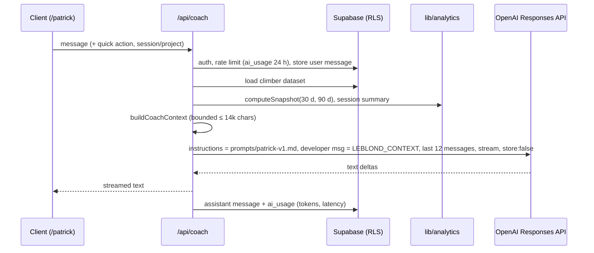

# Patrick “Le Blond” — AI coach

## Pipeline

## Guarantees

- Server-side key only; model from `OPENAI_MODEL`; `CoachProvider` abstraction (`lib/coach/provider.ts`).
- Patrick receives computed figures with counts and explicit definitions — never raw rows. Missing data is `null`, and the prompt tells him not to fill gaps.
- The prompt enforces: native grades first, estimates labelled, Observation / Calculation / Hypothesis structure, wearable data as personal context only, no diagnosis, stop-and-see-a-professional for pain or injury, sustainable volume.
- `store: false` on the provider; LEBLOND keeps its own private history. Telemetry stores no prompt or answer text.
- Rate limit: `MAX_COACH_REQUESTS_PER_USER_PER_DAY` (default 30) on an append-only table.

## Quick actions

What should I climb today? · Analyse my last session · What is holding me back? · How close am I to my target? · Analyse one of my projects · Build my next session · Compare my Arkose and Climbing District performance · What do my recent sessions say about my fatigue? (uses self-reported feelings and personal HR comparisons only).

## Testing

Unit tests cover the context content and budget and the streaming provider (fake SSE). The E2E suite runs `/api/coach` against a local mock of the Responses API (`tests/e2e/mock-openai.mjs`) that echoes figures from the context, proving the persisted session reaches Patrick.
