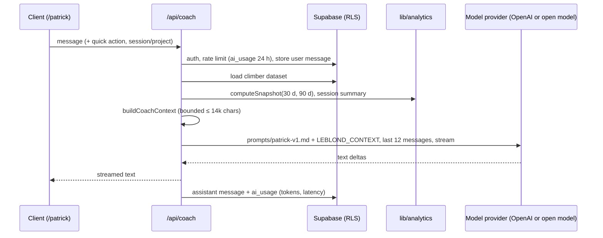

# Patrick “Le Blond” — AI coach

## Pipeline

## Providers

`CoachProvider` (`lib/coach/provider.ts`), selected by `lib/coach/config.ts`:

| `COACH_PROVIDER` | Implementation | Required | Notes |
|---|---|---|---|
| `openai` (default) | `OpenAIResponsesCoach` — Responses API | `OPENAI_API_KEY`, `OPENAI_MODEL` | Evidence as a developer message; `store: false`. |
| `openai-compatible` | `ChatCompletionsCoach` — Chat Completions | `COACH_BASE_URL`, `COACH_MODEL` (`COACH_API_KEY` optional) | Ollama, LM Studio, llama.cpp, vLLM, hosted open-model APIs. Instructions + evidence in a single system message; `<think>…</think>` reasoning stripped from the answer. |

Optional limits for free tiers: `COACH_MAX_OUTPUT_TOKENS`, `COACH_REASONING_EFFORT`, `COACH_HISTORY_CHAR_BUDGET` (history trimmed to the most recent turns that fit, always keeping the question). A provider quota error (HTTP 429/413) is shown to the climber as “Patrick is very busy”, distinct from their own daily limit. The **Patrick live check** GitHub Action runs one synthetic-data question through the configured provider.

For self-hosted servers, make the model's context window at least ~8k tokens (Ollama: `OLLAMA_CONTEXT_LENGTH`); a real Patrick request in testing used about 1.8k prompt tokens with a small dataset and the context is capped at 14k characters. `tests/unit/coach-live-model.test.ts` runs Patrick against a real server when `COACH_LIVE_TEST_BASE_URL` and `COACH_LIVE_TEST_MODEL` are set.

## Guarantees

- Server-side configuration only; no model name hard-coded.
- Patrick receives computed figures with counts and explicit definitions — never raw rows. Missing data is `null`, and the prompt tells him not to fill gaps.
- The prompt enforces: native grades first, estimates labelled, Observation / Calculation / Hypothesis structure, wearable data as personal context only, no diagnosis, stop-and-see-a-professional for pain or injury, sustainable volume.
- `store: false` on the provider; LEBLOND keeps its own private history. Telemetry stores no prompt or answer text.
- Rate limit: `MAX_COACH_REQUESTS_PER_USER_PER_DAY` (default 30) on an append-only table.

## Quick actions

What should I climb today? · Analyse my last session · What is holding me back? · How close am I to my target? · Analyse one of my projects · Build my next session · Compare my Arkose and Climbing District performance · What do my recent sessions say about my fatigue? (uses self-reported feelings and personal HR comparisons only).

## Testing

Unit tests cover the context content and budget and the streaming provider (fake SSE). The E2E suite runs `/api/coach` against a local mock of the Responses API (`tests/e2e/mock-openai.mjs`) that echoes figures from the context, proving the persisted session reaches Patrick.
