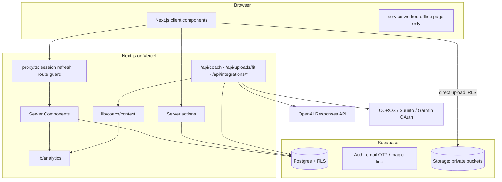

# Architecture

## Layers

| Layer | Where | Rule |
|---|---|---|
| UI | `app/`, `components/` | Server Components by default; Client Components only for interaction. No formulas in JSX. |
| Domain | `lib/climbing`, `lib/grading` | Canonical enums and grade systems. Single source of truth for grade ordering. |
| Analytics | `lib/analytics` | Pure, deterministic, unit-tested functions over plain facts. |
| Persistence | `lib/data`, `lib/actions`, `supabase/migrations` | Supabase with RLS; server actions validate with Zod. |
| AI context | `lib/coach` | Builds a bounded JSON context from analytics; provider abstraction over OpenAI. |
| Integrations | `lib/integrations` | Gym and wearable adapters behind explicit contracts. |

## Request flow

- `proxy.ts` refreshes the Supabase session cookie and redirects anonymous visitors to `/login`.
- `requireViewer()` (server) re-validates the user, checks the whitelist is still active and that onboarding is complete.
- All reads/writes use the **user's** Supabase client so RLS applies. The service-role client is limited to: whitelist pre-check, encrypted token storage, admin roster.
- Media goes straight from the device to Storage (no server hop), then a server action validates and records it.

## Key decisions

- **Native grades are data; Font is an optional estimate.** Never a column overwrite.
- **One analytics snapshot** (`computeSnapshot`) feeds Home, Progress and Patrick, so all surfaces agree.
- **Truthful integrations**: provider status is derived (`resolveProviderStatus`); “Connected” requires a stored authorisation.
- **Next.js 16 conventions**: `proxy.ts` (not middleware), async `params`/`cookies`, typed routes.
