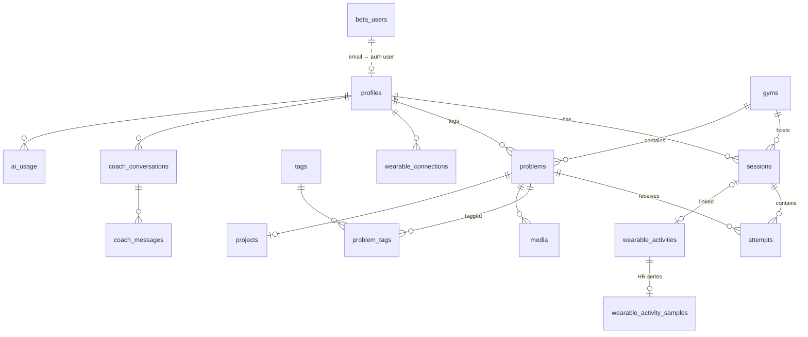

# Data model

All primary keys are UUIDs. Every table holding personal data has RLS scoped to `auth.uid()`. Migration: `supabase/migrations/20261002000000_leblond_v1.sql`.

| Table | Notes |
|---|---|
| `beta_users` | Whitelist (email, display name, `admin`/`beta_tester`, active). Writes: service role only. |
| `profiles` | Created by trigger on sign-up. Target grade + system, optional body metrics, language, onboarding timestamp. |
| `gyms` | Shared catalogue. Check constraint locks Arkose → `ARKOSE_COLOR`, Climbing District → `CLIMBING_DISTRICT_COLOR`. |
| `favourite_gyms` | Per user. |
| `problems` | Private to creator. Native grade validated per system; optional Font estimate with confidence and source (all-or-nothing check). Trigger: grade system must equal the gym's. |
| `tags`, `problem_tags` | 24 style tags from the brief. |
| `sessions` | One live session per user (partial unique index). `source` defaults to `MANUAL`. |
| `attempts` | The core event. `attempt_number` is per climber per problem across sessions; `FLASH` only allowed on attempt 1 (check constraint). Written through `log_attempt()`; only classification/notes are updatable. |
| `media` | Storage path must start with the owner id. |
| `projects` | One per problem; auto-set to `SENT` on a send. |
| `coach_conversations`, `coach_messages` | Patrick history, private. |
| `ai_usage` | Append-only for users (rate-limit integrity). Tokens, latency, request type — no prompt text. |
| `wearable_connections` | Status + encrypted tokens. Clients can read status columns only. |
| `wearable_activities` | Normalised workouts; unique per (user, provider, provider id) + `dedup_key`. |
| `wearable_activity_samples` | Downsampled HR series kept out of the main row. |

Storage buckets: `media` (private, 50 MB, images/videos) and `wearable-files` (private, 4 MB, FIT). Objects live under `<user_id>/…`.
